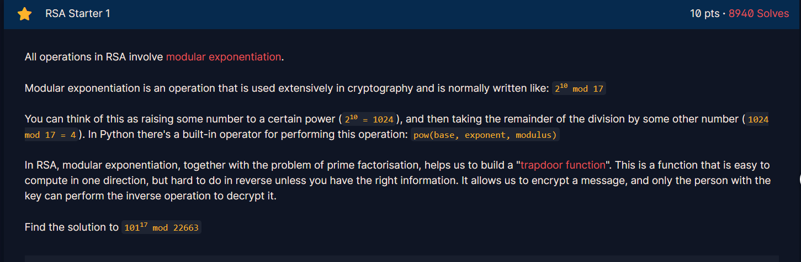
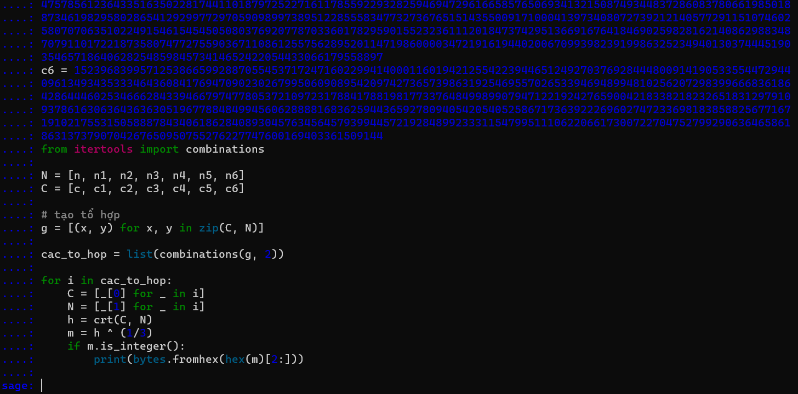

# Giới thiệu về RSA
**Tổng quan:**
- RSA là một sản phẩm nghiên cứu với sự hợp lực của 3 nhà khoa học lớn là Adi Shamir, Len Adleman và Ron Rivest và được đưa ra mô tả lần đầu vào năm 1977 tại Học viện MIT. Cái tên RSA được lấy từ những chữ cái đầu tiên của 3 nhà khoa học.
- RSA là mã hóa bất đối xứng (Asymmetric Encryption).
- Thuật toán RSA có hai khóa: khóa công khai (hay khóa công cộng) và khóa bí mật (hay khóa cá nhân). Mỗi khóa là những số cố định sử dụng trong quá trình mã hóa và giải mã. Khóa công khai được công bố rộng rãi cho mọi người và được dùng để mã hóa. Những thông tin được mã hóa bằng khóa công khai chỉ có thể được giải mã bằng khóa bí mật tương ứng.


**Cách tạo khóa:** <br>

Giả sử An và Bình cần trao đổi thông tin bí mật thông qua một kênh không an toàn (ví dụ như Internet). Với thuật toán RSA, An đầu tiên cần tạo ra cho mình cặp khóa gồm khóa công khai và khóa bí mật theo các bước sau:

Bước 1: Chọn hai số nguyên tố lớn và khác nhau p và q. Đây là những số ngẫu nhiên và độc lập.

Bước 2: Tính $n = p*q$. Giá trị n sẽ được sử dụng trong quá trình mã hóa và giải mã.

Bước 3: Tính giá trị hàm số Euler $ϕ(n) = (p-1) * (q-1)$. Hàm số Euler ϕ(n) biểu thị số lượng số nguyên tố nhỏ hơn n và cùng nhau với n.

Bước 4: Chọn một số nguyên e thỏa mãn điều kiện $1 < e < ϕ(n)$ và e là số nguyên tố cùng nhau với $ϕ(n)$. Số nguyên e sẽ là khóa công khai.

Bước 5: Tìm số nguyên d sao cho $(d * e) ≡ 1 \pmod {\phi (n)}$. Trong đó, $mod ϕ(n)$ biểu thị phép chia lấy dư khi chia cho $ϕ(n)$. Số nguyên $d$ sẽ là khóa bí mật.

Sau khi đã tạo được cặp khóa gồm khóa công khai (n, e) và khóa bí mật (n, d), An có thể giữ khóa bí mật cho mình và chia sẻ khóa công khai với Bình. Bình sẽ sử dụng khóa công khai để mã hóa thông tin và gửi cho An. An sẽ sử dụng khóa bí mật để giải mã thông tin mà Bình đã gửi.

Để đọc được thông tin mà An gửi đi Bình chỉ cần có khóa bí mật và giải mã bằng cách $m = c ^ d \pmod N$


# Các kiểu tấn công thường gặp của RSA
>Làm sao để bẻ khóa khi thiếu các dữ kiện?????


## Factorizing the public key
Khi nhận được public-key nếu ta có thể phân tích được N thành tích các số nguyên tố thì việc tính toán khóa bí mật trở nên dễ dàng. <br>
ví dụ: N = p*q với p và q là các số nguyên tố <br>
--> phi = (p-1)(q-1) --> d = e^(-1) mod phi <br>
vậy là ta đã tìm ra ngay được khóa

Có rất nhiều công cụ ví dụ như. [factordb.com](http://factordb.com/index.php?id=1100000001489276241), sagemath, các lib có sẵn trong python,... Nhưng chúng chỉ phân tích được N với độ dài nhất định

## Common Modulus
Hãy tưởng tượng chúng ta có Alice và Bob. Alice gửi cùng một tin nhắn cho Bob nhiều lần bằng cách sử dụng hai public-key là (e1, N) và (e2, N) chúng cùng chung modul N <br>
Các dữ liệu ta cần có là c1, c2, e1, e2, N và đi tìm m(plaintext) <br>

Điều kiện để sử dụng được Common Modulus Attack:<br>
$gcd(e_1, e_2) = 1$
$gcd(c_2, N) = 1$

Sử dụng Phương trình Diophantos: $u.e_1 + v.e_2 = gcd(e_1, e_2) = 1$ dễ dàng tìm được u và v bằng thuật toán Euclid mở rộng.

Ta có: $C_1 ^ u * C_2 ^ v = m^{e_1*u + e_2*v} = m^1 = m$ <br>
Vì thông thường N rất lớn so với m nên ta nhận được ngay kết quả là plaintext

## Small public exponent
Có những trường hợp publickey chỉ lấy e = 3 để thực hiện tính toán nhanh chóng.

Ta có 1 plaintext m, ta có thể tìm nó nhanh chóng bằng tính căn bậc 3 thôi. `pow(c+ N*k, 1/3) ` với k là số nguyên ta brute-force k cho đến khi tìm ra kết quả, nhưng đôi khi nó không khả thi.

## Fermat’s attack
Trong mã RSA thì p và q là 2 số nguyên tố thương được chọn chung độ dài với nhau để tạo nên một mã RSA mạnh, nhưng khi p và q quá gần nhau lại xảy ra chuyện =))) <br>

Điều kiện để sử dụng:
$p-q < N^{1/4}$ <br>
Ta có:

Sử dụng [Fermat's factorization method](https://en.wikipedia.org/wiki/Fermat's_factorization_method) để tìm được p và q và thực hiện giải mã để tìm được plaintext

## Wiener's Attack:
Tham khảo: [https://cryptohack.gitbook.io/cryptobook/untitled/low-private-component-attacks/wieners-attack](https://cryptohack.gitbook.io/cryptobook/untitled/low-private-component-attacks/wieners-attack) <br>
Điều kiện để thực hiện được:
$q < p < 2q$ và $d < \frac{1}{3}.\ N^{\frac{1}{4}}$

Đây là hàm để thực hiện tấn công trong Sagemath:
```python
from Crypto.Util.number import long_to_bytes

def wiener(e, n):
    # Convert e/n into a continued fraction
    cf = continued_fraction(e/n)
    convergents = cf.convergents()
    for kd in convergents:
        k = kd.numerator()
        d = kd.denominator()
        # Check if k and d meet the requirements
        if k == 0 or d%2 == 0 or e*d % k != 1:
            continue
        phi = (e*d - 1)/k
        # Create the polynomial
        x = PolynomialRing(RationalField(), 'x').gen()
        f = x^2 - (n-phi+1)*x + n
        roots = f.roots()
        # Check if polynomial as two roots
        if len(roots) != 2:
            continue
        # Check if roots of the polynomial are p and q
        p,q = int(roots[0][0]), int(roots[1][0])
        if p*q == n:
            return d
    return None
```
Ngoài ra còn có lib owiener hỗ trợ việc tấn công:
```python
#!/usr/bin/env python3
import owiener
from Crypto.Util.number import long_to_bytes

#--------Data--------#

N = <N>
e = <e>
c = <c>

#--------Wiener's attack--------#

d = owiener.attack(e, N)

if d:
    m = pow(c, d, N)
    flag = long_to_bytes(m).decode()
    print(flag)
else:
    print("Wiener's Attack failed.")
```
## Boneh-Durfee Attack
Tham khảo: [https://cryptohack.gitbook.io/cryptobook/untitled/low-private-component-attacks/wieners-attack](https://cryptohack.gitbook.io/cryptobook/untitled/low-private-component-attacks/wieners-attack) <br>
Loại tấn công này mạnh hơn so với Wiener's Attack <br>
Điều kiện để thực hiện: $d < N^{0.292}$ <br>

Đây là hàm để thực hiện tấn công trong Sagemath:
[https://github.com/mimoo/RSA-and-LLL-attacks/blob/master/boneh_durfee.sage](https://github.com/mimoo/RSA-and-LLL-attacks/blob/master/boneh_durfee.sage)

## Hastad’s Broadcast Attack
Bob gửi cùng một tin nhắn cho nhiều người nhưng sử dụng các bộ khóa khác nhau nhưng cùng e. <br>

Giả sử e = 3 và có hệ pt đồng dư như sau: <br>
$c_1 = m^3 \mod n_1$ <br>
$c_2 = m^3 \mod n_2$ <br>
$c_3 = m^3 \mod n_3$ <br>

Chúng ta có thể sử dụng Thặng Dư Trung Hoa để tìm ra m dễ dàng. Nhưng không phải tất cả trường hợp đều nhận được plaintext đâu nha :))))

## Blinding
Bob là người sở hữu các khóa (N, e, d) để đảm bảo các quyền riêng tư của anh ấy. Nếu có một kẻ gian muốn sở hữu chữ ký của N trên một đoạn tin nhắn M nhưng không được sự cho phép của Bob. Hắn có thể sử dụng cách sau: <br>

Chọn một số ngẫu nghiên $r \in Z_N^*$ và cho $M^{'} = r^e * M$ 
Khi này Bob không hề nghi ngờ gì về $M^{'}$ và ký lên: $S^{'} = {M^{'}}^ d$  để lấy được chữ ký hắn chỉ cần $S = S^{'} / r$ <br>
Minh chứng cho điều đó: ](image/image-52.png)

Tài liệu tham khảo:


# Challenges CryptoHack RSA:
## RSA Starter 1:
 <br>
để thực hiện phép toán trên mình sử dụng python<br>


flag là: `crypto{19906}`

## RSA Starter 2:


ở chall này mình cần mã hóa `12` bằng RSA: <br>
$$c = m^e \mod N$$


flag là: `crypto{301}`

## RSA Starter 3:


Tính $\phi (N)$ từ định lý Euler:$\phi (N) = (p-1)*(q-1)$ <br>


flag là: `crypto{882564595536224140639625987657529300394956519977044270821168}`

## RSA Starter 4:


Tính khóa bí mật d (là nghịch đảo của e trong modul $\phi (n)$): <br>
$(d * e) ≡ 1 \pmod {\phi (n)}$
suy ra: $d \equiv e^{-1} \pmod {\phi (n)}$ <br>
mình sẽ lấy $\phi (N)$ từ chall trên vì các số liệu trùng nhau:


flag là: `121832886702415731577073962957377780195510499965398469843281`

## RSA Starter 5:


thực hiện giải mã c:
$m = c^d \pmod N$ <br>


flag là: `crypto{13371337}`

## RSA Starter 6:

Để đảm bảo thông tin được an toàn và xác minh được người gửi thì ngta đã tạo ra chữ ký số bằng cách dùng hàm băm để mã hóa trước plaintext sau đó mới sử dụng RSA <br>

chall cho ta một file chứa private key: <br>
`N=15216583654836731327639981224133918855895948374072384050848479908982286890731769486609085918857664046075375253168955058743185664390273058074450390236774324903305663479046566232967297765731625328029814055635316002591227570271271445226094919864475407884459980489638001092788574811554149774028950310695112688723853763743238753349782508121985338746755237819373178699343135091783992299561827389745132880022259873387524273298850340648779897909381979714026837172003953221052431217940632552930880000919436507245150726543040714721553361063311954285289857582079880295199632757829525723874753306371990452491305564061051059885803`

`d=11175901210643014262548222473449533091378848269490518850474399681690547281665059317155831692300453197335735728459259392366823302405685389586883670043744683993709123180805154631088513521456979317628012721881537154107239389466063136007337120599915456659758559300673444689263854921332185562706707573660658164991098457874495054854491474065039621922972671588299315846306069845169959451250821044417886630346229021305410340100401530146135418806544340908355106582089082980533651095594192031411679866134256418292249592135441145384466261279428795408721990564658703903787956958168449841491667690491585550160457893350536334242689` <br>

đầu tiên ta cần đưa dữ liệu cần ký về dạng byte  `b'crypto{Immut4ble_m3ssag1ng}'` sau đó sử dụng hàm băm vì đầu ra của hàm băm là string nên mình cần chuyển nó về dạng số để tính toán

**script:**
```python
from Crypto.Util.number import bytes_to_long
import hashlib

# compute H(m)
m = b'crypto{Immut4ble_m3ssag1ng}'
H_m = hashlib.sha256(m).hexdigest()
# private keys
N=15216583654836731327639981224133918855895948374072384050848479908982286890731769486609085918857664046075375253168955058743185664390273058074450390236774324903305663479046566232967297765731625328029814055635316002591227570271271445226094919864475407884459980489638001092788574811554149774028950310695112688723853763743238753349782508121985338746755237819373178699343135091783992299561827389745132880022259873387524273298850340648779897909381979714026837172003953221052431217940632552930880000919436507245150726543040714721553361063311954285289857582079880295199632757829525723874753306371990452491305564061051059885803
d=11175901210643014262548222473449533091378848269490518850474399681690547281665059317155831692300453197335735728459259392366823302405685389586883670043744683993709123180805154631088513521456979317628012721881537154107239389466063136007337120599915456659758559300673444689263854921332185562706707573660658164991098457874495054854491474065039621922972671588299315846306069845169959451250821044417886630346229021305410340100401530146135418806544340908355106582089082980533651095594192031411679866134256418292249592135441145384466261279428795408721990564658703903787956958168449841491667690491585550160457893350536334242689
# sign
H_m_int = int(H_m, 16)
S = pow(H_m_int, d, N)
print(hex(S)[2:])
```


flag là: `6ac9bb8f110b318a40ad8d7e57defdcce2652f5928b5f9b97c1504d7096d7af1d34e477b30f1a08014e8d525b14458b709a77a5fa67d4711bd19da1446f9fb0ffd9fdedc4101bdc9a4b26dd036f11d02f6b56f4926170c643f302d59c4fe8ea678b3ca91b4bb9b2024f2a839bec1514c0242b57e1f5e77999ee67c450982730252bc2c3c35acb4ac06a6ce8b9dbf84e29df0baa7369e0fd26f6dfcfb22a464e05c5b72baba8f78dc742e96542169710918ee2947749477869cb3567180ccbdfe6fdbe85bcaca4bf6da77c8f382bb4c8cd56dee43d1290ca856318c97f1756b789e3cac0c9738f5e9f797314d39a2ededb92583d97124ec6b313c4ea3464037d3`

## PRIMES PART 1:


Trong mật mã RSA khi chọn các số nguyên tố để tạo khóa thì cần chọn ngẫu nhiên và có độ lớn phù hợp để tránh khóa bị bẻ bằng cách phân tích được N thành các thừa số nguyên tố. <br>

để phân tích N thành thừa số nguyên tố mình sử dụng [fatordb.com](http://factordb.com/index.php?id=1100000001489276241)


dán số cần phân tích:


ngoài ra còn có thể sử dụng thư viện `factordb` có sẵn của python và hàm `ecm.factor()` trong Sagemath

flag là: `crypto{19704762736204164635843}`

## Inferius Prime


đây là file inferius.py 
```python
#!/usr/bin/env python3

from Crypto.Util.number import getPrime, inverse, bytes_to_long, long_to_bytes, GCD

e = 3

# n will be 8 * (100 + 100) = 1600 bits strong which is pretty good
while True:
    p = getPrime(100)
    q = getPrime(100)
    phi = (p - 1) * (q - 1)
    d = inverse(e, phi)
    if d != -1 and GCD(e, phi) == 1:
        break

n = p * q

flag = b"XXXXXXXXXXXXXXXXXXXXXXX"
pt = bytes_to_long(flag)
ct = pow(pt, e, n)

print(f"n = {n}")
print(f"e = {e}")
print(f"ct = {ct}")

pt = pow(ct, d, n)
decrypted = long_to_bytes(pt)
assert decrypted == flag

```
còn đây là output.txt
```
n=742449129124467073921545687640895127535705902454369756401331
e = 3
ct=39207274348578481322317340648475596807303160111338236677373
```

nhìn có vẻ n không được 1600 bit thì phải :)))) <br>
ở đây với độ dài của n mình có thể dễ dang phân tích thành thừa số nguyên tố <br>


**script:**
```python
from Crypto.Util.number import long_to_bytes, inverse
from sympy import root
n=742449129124467073921545687640895127535705902454369756401331
e = 3
ct=39207274348578481322317340648475596807303160111338236677373

p = 752708788837165590355094155871
q = 986369682585281993933185289261
phi = (p-1)*(q-1)
d = inverse(e, phi)

m = pow(ct, d, n)
flag = long_to_bytes(m)
print(flag)
    
```


flag là: `crypto{N33d_b1g_pR1m35}`

## Monoprime:


```
n=171731371218065444125482536302245915415603318380280392385291836472299752747934607246477508507827284075763910264995326010251268493630501989810855418416643352631102434317900028697993224868629935657273062472544675693365930943308086634291936846505861203914449338007760990051788980485462592823446469606824421932591                                                                  
e = 65537
ct=161367550346730604451454756189028938964941280347662098798775466019463375610700074840105776873791605070092554650190486030367121011578171525759600774739890458414593857709994072516290998135846956596662071379067305011746842247628316996977338024343628757374524136260758515864509435302781735938531030576289086798942  
```
mình thử phân tích n thì thấy nó là một số nguyên tố


khi n là một số nguyên tố thì ta sẽ luôn được $\phi (n) = n -1$ làm cho việc bẻ khóa trở nên dễ dàng

**script:**
```python
n = 171731371218065444125482536302245915415603318380280392385291836472299752747934607246477508507827284075763910264995326010251268493630501989810855418416643352631102434317900028697993224868629935657273062472544675693365930943308086634291936846505861203914449338007760990051788980485462592823446469606824421932591                                                                  
e = 65537
ct = 161367550346730604451454756189028938964941280347662098798775466019463375610700074840105776873791605070092554650190486030367121011578171525759600774739890458414593857709994072516290998135846956596662071379067305011746842247628316996977338024343628757374524136260758515864509435302781735938531030576289086798942  

phi = n -1
d = pow(e, -1, phi)
m = pow(ct, d, n)

print(bytes.fromhex(hex(m)[2:]))
```


flag là: `crypto{0n3_pr1m3_41n7_pr1m3_l0l}`

## Square Eyes


đây là những gì có trong out.txt:
```
n = 535860808044009550029177135708168016201451343147313565371014459027743491739422885443084705720731409713775527993719682583669164873806842043288439828071789970694759080842162253955259590552283047728782812946845160334801782088068154453021936721710269050985805054692096738777321796153384024897615594493453068138341203673749514094546000253631902991617197847584519694152122765406982133526594928685232381934742152195861380221224370858128736975959176861651044370378539093990198336298572944512738570839396588590096813217791191895941380464803377602779240663133834952329316862399581950590588006371221334128215409197603236942597674756728212232134056562716399155080108881105952768189193728827484667349378091100068224404684701674782399200373192433062767622841264055426035349769018117299620554803902490432339600566432246795818167460916180647394169157647245603555692735630862148715428791242764799469896924753470539857080767170052783918273180304835318388177089674231640910337743789750979216202573226794240332797892868276309400253925932223895530714169648116569013581643192341931800785254715083294526325980247219218364118877864892068185905587410977152737936310734712276956663192182487672474651103240004173381041237906849437490609652395748868434296753449
e = 65537
ct = 222502885974182429500948389840563415291534726891354573907329512556439632810921927905220486727807436668035929302442754225952786602492250448020341217733646472982286222338860566076161977786095675944552232391481278782019346283900959677167026636830252067048759720251671811058647569724495547940966885025629807079171218371644528053562232396674283745310132242492367274184667845174514466834132589971388067076980563188513333661165819462428837210575342101036356974189393390097403614434491507672459254969638032776897417674577487775755539964915035731988499983726435005007850876000232292458554577437739427313453671492956668188219600633325930981748162455965093222648173134777571527681591366164711307355510889316052064146089646772869610726671696699221157985834325663661400034831442431209123478778078255846830522226390964119818784903330200488705212765569163495571851459355520398928214206285080883954881888668509262455490889283862560453598662919522224935145694435885396500780651530829377030371611921181207362217397805303962112100190783763061909945889717878397740711340114311597934724670601992737526668932871436226135393872881664511222789565256059138002651403875484920711316522536260604255269532161594824301047729082877262812899724246757871448545439896

```

mình tiếp tục thử phân tích n <br>


nhận thấy n là bình phương của một số nguyên tố mình tính phi bằng định lý Euler $\phi (n) = n * (1-\frac{1}{p})$
ở trong trường hợp này $n = p^2$ suy ra $\phi (n) = p*(p-1)$

**script:**
```python
n = ...
e = 65537
ct = ...
p = 23148667521998097720857168827790771337662483716348435477360567409355026169165934446949809664595523770853897203103759106983985113264049057416908191166720008503275951625738975666019029172377653170602440373579593292576530667773951407647222757756437867216095193174201323278896027294517792607881861855264600525772460745259440301156930943255240915685718552334192230264780355799179037816026330705422484000086542362084006958158550346395941862383925942033730030004606360308379776255436206440529441711859246811586652746028418496020145441513037535475380962562108920699929022900677901988508936509354385660735694568216631382653107
phi = p*(p-1)

d = pow(e, -1, phi)
m = pow(ct, d, n)

print(bytes.fromhex(hex(m)[2:]))
```


flag là: `crypto{squar3_r00t_i5_f4st3r_th4n_f4ct0r1ng!}`

## Manyprime


đây là những gì có trong output.txt
```
n = 580642391898843192929563856870897799650883152718761762932292482252152591279871421569162037190419036435041797739880389529593674485555792234900969402019055601781662044515999210032698275981631376651117318677368742867687180140048715627160641771118040372573575479330830092989800730105573700557717146251860588802509310534792310748898504394966263819959963273509119791037525504422606634640173277598774814099540555569257179715908642917355365791447508751401889724095964924513196281345665480688029639999472649549163147599540142367575413885729653166517595719991872223011969856259344396899748662101941230745601719730556631637
e = 65537
ct = 320721490534624434149993723527322977960556510750628354856260732098109692581338409999983376131354918370047625150454728718467998870322344980985635149656977787964380651868131740312053755501594999166365821315043312308622388016666802478485476059625888033017198083472976011719998333985531756978678758897472845358167730221506573817798467100023754709109274265835201757369829744113233607359526441007577850111228850004361838028842815813724076511058179239339760639518034583306154826603816927757236549096339501503316601078891287408682099750164720032975016814187899399273719181407940397071512493967454225665490162619270814464
```
tiếp tục phân tích n này mình 


## Salty

đây là những gì có trong file output
```
n = 110581795715958566206600392161360212579669637391437097703685154237017351570464767725324182051199901920318211290404777259728923614917211291562555864753005179326101890427669819834642007924406862482343614488768256951616086287044725034412802176312273081322195866046098595306261781788276570920467840172004530873767                                                                  
e = 1
ct = 44981230718212183604274785925793145442655465025264554046028251311164494127485

```
nhận thấy e = 1 suy ra $c = m \pmod n$ nhận thấy c rất bé so với n ta lấy được ngay c = m <br>
sử dụng hàm `long_to_bytes` để có ngay flag


flag là: `crypto{saltstack_fell_for_this!}`

## Modulus Inutilis


thông tin có được trong file input:
```
n = 17258212916191948536348548470938004244269544560039009244721959293554822498047075403658429865201816363311805874117705688359853941515579440852166618074161313773416434156467811969628473425365608002907061241714688204565170146117869742910273064909154666642642308154422770994836108669814632309362483307560217924183202838588431342622551598499747369771295105890359290073146330677383341121242366368309126850094371525078749496850520075015636716490087482193603562501577348571256210991732071282478547626856068209192987351212490642903450263288650415552403935705444809043563866466823492258216747445926536608548665086042098252335883
e = 3
ct = 243251053617903760309941844835411292373350655973075480264001352919865180151222189820473358411037759381328642957324889519192337152355302808400638052620580409813222660643570085177957


```
giờ thì n đã rất là to :)))) <br>
nhưng e lại rất nhỏ đây chính là điểm yếu như đã biết: <br>
$c = m^e \pmod n$ suy ra $m = k*n + c$ với k là số tự nhiên<br>
mình sẽ brute-force k:
```python
import gmpy2 

n = ...
e = 3
ct = ...

for i in range(1000):
    m , is_root = gmpy2.iroot(i*n + ct, e)
    if is_root:
        print(bytes.fromhex(hex(m)[2:]))

```
Việc tính toán mình sử dụng Lib gmpy2 là một công cụ mạnh trong việc tính toán các số nguyên lớn <br>


Flag là: `crypto{N33d_m04R_p4dd1ng}`

## Everything_is_Big


Đây là những gì có trong output.txt:
```
N = 0xb8af3d3afb893a602de4afe2a29d7615075d1e570f8bad8ebbe9b5b9076594cf06b6e7b30905b6420e950043380ea746f0a14dae34469aa723e946e484a58bcd92d1039105871ffd63ffe64534b7d7f8d84b4a569723f7a833e6daf5e182d658655f739a4e37bd9f4a44aff6ca0255cda5313c3048f56eed5b21dc8d88bf5a8f8379eac83d8523e484fa6ae8dbcb239e65d3777829a6903d779cd2498b255fcf275e5f49471f35992435ee7cade98c8e82a8beb5ce1749349caa16759afc4e799edb12d299374d748a9e3c82e1cc983cdf9daec0a2739dadcc0982c1e7e492139cbff18c5d44529407edfd8e75743d2f51ce2b58573fea6fbd4fe25154b9964d
e = 0x9ab58dbc8049b574c361573955f08ea69f97ecf37400f9626d8f5ac55ca087165ce5e1f459ef6fa5f158cc8e75cb400a7473e89dd38922ead221b33bc33d6d716fb0e4e127b0fc18a197daf856a7062b49fba7a86e3a138956af04f481b7a7d481994aeebc2672e500f3f6d8c581268c2cfad4845158f79c2ef28f242f4fa8f6e573b8723a752d96169c9d885ada59cdeb6dbe932de86a019a7e8fc8aeb07748cfb272bd36d94fe83351252187c2e0bc58bb7a0a0af154b63397e6c68af4314601e29b07caed301b6831cf34caa579eb42a8c8bf69898d04b495174b5d7de0f20cf2b8fc55ed35c6ad157d3e7009f16d6b61786ee40583850e67af13e9d25be3
c = 0x3f984ff5244f1836ed69361f29905ca1ae6b3dcf249133c398d7762f5e277919174694293989144c9d25e940d2f66058b2289c75d1b8d0729f9a7c4564404a5fd4313675f85f31b47156068878e236c5635156b0fa21e24346c2041ae42423078577a1413f41375a4d49296ab17910ae214b45155c4570f95ca874ccae9fa80433a1ab453cbb28d780c2f1f4dc7071c93aff3924d76c5b4068a0371dff82531313f281a8acadaa2bd5078d3ddcefcb981f37ff9b8b14c7d9bf1accffe7857160982a2c7d9ee01d3e82265eec9c7401ecc7f02581fd0d912684f42d1b71df87a1ca51515aab4e58fab4da96e154ea6cdfb573a71d81b2ea4a080a1066e1bc3474
```
Tất cả mọi thứ đều lớn với việc e lớn như vậy thì dẫn đến d sẽ nhỏ mình sẽ sử dụng [Wiener Attack](https://en.wikipedia.org/wiki/Wiener%27s_attack): <br>

**script:**
```python
import owiener
from Crypto.Util.number import long_to_bytes
N = int('0xb8af3d3afb893a602de4afe2a29d7615075d1e570f8bad8ebbe9b5b9076594cf06b6e7b30905b6420e950043380ea746f0a14dae34469aa723e946e484a58bcd92d1039105871ffd63ffe64534b7d7f8d84b4a569723f7a833e6daf5e182d658655f739a4e37bd9f4a44aff6ca0255cda5313c3048f56eed5b21dc8d88bf5a8f8379eac83d8523e484fa6ae8dbcb239e65d3777829a6903d779cd2498b255fcf275e5f49471f35992435ee7cade98c8e82a8beb5ce1749349caa16759afc4e799edb12d299374d748a9e3c82e1cc983cdf9daec0a2739dadcc0982c1e7e492139cbff18c5d44529407edfd8e75743d2f51ce2b58573fea6fbd4fe25154b9964d',16)
e = int('0x9ab58dbc8049b574c361573955f08ea69f97ecf37400f9626d8f5ac55ca087165ce5e1f459ef6fa5f158cc8e75cb400a7473e89dd38922ead221b33bc33d6d716fb0e4e127b0fc18a197daf856a7062b49fba7a86e3a138956af04f481b7a7d481994aeebc2672e500f3f6d8c581268c2cfad4845158f79c2ef28f242f4fa8f6e573b8723a752d96169c9d885ada59cdeb6dbe932de86a019a7e8fc8aeb07748cfb272bd36d94fe83351252187c2e0bc58bb7a0a0af154b63397e6c68af4314601e29b07caed301b6831cf34caa579eb42a8c8bf69898d04b495174b5d7de0f20cf2b8fc55ed35c6ad157d3e7009f16d6b61786ee40583850e67af13e9d25be3',16)
c = int('0x3f984ff5244f1836ed69361f29905ca1ae6b3dcf249133c398d7762f5e277919174694293989144c9d25e940d2f66058b2289c75d1b8d0729f9a7c4564404a5fd4313675f85f31b47156068878e236c5635156b0fa21e24346c2041ae42423078577a1413f41375a4d49296ab17910ae214b45155c4570f95ca874ccae9fa80433a1ab453cbb28d780c2f1f4dc7071c93aff3924d76c5b4068a0371dff82531313f281a8acadaa2bd5078d3ddcefcb981f37ff9b8b14c7d9bf1accffe7857160982a2c7d9ee01d3e82265eec9c7401ecc7f02581fd0d912684f42d1b71df87a1ca51515aab4e58fab4da96e154ea6cdfb573a71d81b2ea4a080a1066e1bc3474',16)
d = owiener.attack(e,N)
m = pow(c,d,N)
print(long_to_bytes(m).decode())
```
flag là: `crypto{s0m3th1ng5_c4n_b3_t00_b1g}`


## Crossed Wires


Đây là những gì có trong output.txt: <br>
```
My private key: (21711308225346315542706844618441565741046498277716979943478360598053144971379956916575370343448988601905854572029635846626259487297950305231661109855854947494209135205589258643517961521594924368498672064293208230802441077390193682958095111922082677813175804775628884377724377647428385841831277059274172982280545237765559969228707506857561215268491024097063920337721783673060530181637161577401589126558556182546896783307370517275046522704047385786111489447064794210010802761708615907245523492585896286374996088089317826162798278528296206977900274431829829206103227171839270887476436899494428371323874689055690729986771, 2734411677251148030723138005716109733838866545375527602018255159319631026653190783670493107936401603981429171880504360560494771017246468702902647370954220312452541342858747590576273775107870450853533717116684326976263006435733382045807971890762018747729574021057430331778033982359184838159747331236538501849965329264774927607570410347019418407451937875684373454982306923178403161216817237890962651214718831954215200637651103907209347900857824722653217179548148145687181377220544864521808230122730967452981435355334932104265488075777638608041325256776275200067541533022527964743478554948792578057708522350812154888097)
My Friend's public keys: [(21711308225346315542706844618441565741046498277716979943478360598053144971379956916575370343448988601905854572029635846626259487297950305231661109855854947494209135205589258643517961521594924368498672064293208230802441077390193682958095111922082677813175804775628884377724377647428385841831277059274172982280545237765559969228707506857561215268491024097063920337721783673060530181637161577401589126558556182546896783307370517275046522704047385786111489447064794210010802761708615907245523492585896286374996088089317826162798278528296206977900274431829829206103227171839270887476436899494428371323874689055690729986771, 106979), (21711308225346315542706844618441565741046498277716979943478360598053144971379956916575370343448988601905854572029635846626259487297950305231661109855854947494209135205589258643517961521594924368498672064293208230802441077390193682958095111922082677813175804775628884377724377647428385841831277059274172982280545237765559969228707506857561215268491024097063920337721783673060530181637161577401589126558556182546896783307370517275046522704047385786111489447064794210010802761708615907245523492585896286374996088089317826162798278528296206977900274431829829206103227171839270887476436899494428371323874689055690729986771, 108533), (21711308225346315542706844618441565741046498277716979943478360598053144971379956916575370343448988601905854572029635846626259487297950305231661109855854947494209135205589258643517961521594924368498672064293208230802441077390193682958095111922082677813175804775628884377724377647428385841831277059274172982280545237765559969228707506857561215268491024097063920337721783673060530181637161577401589126558556182546896783307370517275046522704047385786111489447064794210010802761708615907245523492585896286374996088089317826162798278528296206977900274431829829206103227171839270887476436899494428371323874689055690729986771, 69557), (21711308225346315542706844618441565741046498277716979943478360598053144971379956916575370343448988601905854572029635846626259487297950305231661109855854947494209135205589258643517961521594924368498672064293208230802441077390193682958095111922082677813175804775628884377724377647428385841831277059274172982280545237765559969228707506857561215268491024097063920337721783673060530181637161577401589126558556182546896783307370517275046522704047385786111489447064794210010802761708615907245523492585896286374996088089317826162798278528296206977900274431829829206103227171839270887476436899494428371323874689055690729986771, 97117), (21711308225346315542706844618441565741046498277716979943478360598053144971379956916575370343448988601905854572029635846626259487297950305231661109855854947494209135205589258643517961521594924368498672064293208230802441077390193682958095111922082677813175804775628884377724377647428385841831277059274172982280545237765559969228707506857561215268491024097063920337721783673060530181637161577401589126558556182546896783307370517275046522704047385786111489447064794210010802761708615907245523492585896286374996088089317826162798278528296206977900274431829829206103227171839270887476436899494428371323874689055690729986771, 103231)]
Encrypted flag: 20304610279578186738172766224224793119885071262464464448863461184092225736054747976985179673905441502689126216282897704508745403799054734121583968853999791604281615154100736259131453424385364324630229671185343778172807262640709301838274824603101692485662726226902121105591137437331463201881264245562214012160875177167442010952439360623396658974413900469093836794752270399520074596329058725874834082188697377597949405779039139194196065364426213208345461407030771089787529200057105746584493554722790592530472869581310117300343461207750821737840042745530876391793484035024644475535353227851321505537398888106855012746117

```

```python
from Crypto.Util.number import getPrime, long_to_bytes, bytes_to_long, inverse
import math
from gmpy2 import next_prime

FLAG = b"crypto{????????????????????????????????????????????????}"

p = getPrime(1024)
q = getPrime(1024)
N = p*q
phi = (p-1)*(q-1)
e = 0x10001
d = inverse(e, phi)

my_key = (N, d)

friends = 5
friend_keys = [(N, getPrime(17)) for _ in range(friends)]

cipher = bytes_to_long(FLAG)

for key in friend_keys:
    cipher = pow(cipher, key[1], key[0])

print(f"My private key: {my_key}")
print(f"My Friend's public keys: {friend_keys}")
print(f"Encrypted flag: {cipher}")

```
Mình thử phân tích n.


Nhận thấy flag được mã hóa nhiều lần bằng nhiều e khác nhau nên mình sẽ dụng vòng lặp để giải mã lại:

**script:**
```python
c = 20304610279578186738172766224224793119885071262464464448863461184092225736054747976985179673905441502689126216282897704508745403799054734121583968853999791604281615154100736259131453424385364324630229671185343778172807262640709301838274824603101692485662726226902121105591137437331463201881264245562214012160875177167442010952439360623396658974413900469093836794752270399520074596329058725874834082188697377597949405779039139194196065364426213208345461407030771089787529200057105746584493554722790592530472869581310117300343461207750821737840042745530876391793484035024644475535353227851321505537398888106855012746117
e = [106979, 108533, 69557, 97117, 103231]
n = 21711308225346315542706844618441565741046498277716979943478360598053144971379956916575370343448988601905854572029635846626259487297950305231661109855854947494209135205589258643517961521594924368498672064293208230802441077390193682958095111922082677813175804775628884377724377647428385841831277059274172982280545237765559969228707506857561215268491024097063920337721783673060530181637161577401589126558556182546896783307370517275046522704047385786111489447064794210010802761708615907245523492585896286374996088089317826162798278528296206977900274431829829206103227171839270887476436899494428371323874689055690729986771
d = 2734411677251148030723138005716109733838866545375527602018255159319631026653190783670493107936401603981429171880504360560494771017246468702902647370954220312452541342858747590576273775107870450853533717116684326976263006435733382045807971890762018747729574021057430331778033982359184838159747331236538501849965329264774927607570410347019418407451937875684373454982306923178403161216817237890962651214718831954215200637651103907209347900857824722653217179548148145687181377220544864521808230122730967452981435355334932104265488075777638608041325256776275200067541533022527964743478554948792578057708522350812154888097

p = 134460556242811604004061671529264401215233974442536870999694816691450423689575549530215841622090861571494882591368883283016107051686642467260643894947947473532769025695530343815260424314855023688439603651834585971233941772580950216838838690315383700689885536546289584980534945897919914730948196240662991266027
q = 161469718942256895682124261315253003309512855995894840701317251772156087404025170146631429756064534716206164807382734456438092732743677793224010769460318383691408352089793973150914149255603969984103815563896440419666191368964699279209687091969164697704779792586727943470780308857107052647197945528236341228473
phi = (p-1)*(q-1)
for i in e[::-1]:
    d = pow(i, -1, phi)
    c = pow(c, d, n)
    
print(bytes.fromhex(hex(c)[2:]))
```


Flag là: `crypto{3ncrypt_y0ur_s3cr3t_w1th_y0ur_fr1end5_publ1c_k3y}`

## Everything is Still Big:


Đây là những gì có file output.txt:
```
N = 0xb12746657c720a434861e9a4828b3c89a6b8d4a1bd921054e48d47124dbcc9cfcdcc39261c5e93817c167db818081613f57729e0039875c72a5ae1f0bc5ef7c933880c2ad528adbc9b1430003a491e460917b34c4590977df47772fab1ee0ab251f94065ab3004893fe1b2958008848b0124f22c4e75f60ed3889fb62e5ef4dcc247a3d6e23072641e62566cd96ee8114b227b8f498f9a578fc6f687d07acdbb523b6029c5bbeecd5efaf4c4d35304e5e6b5b95db0e89299529eb953f52ca3247d4cd03a15939e7d638b168fd00a1cb5b0cc5c2cc98175c1ad0b959c2ab2f17f917c0ccee8c3fe589b4cb441e817f75e575fc96a4fe7bfea897f57692b050d2b
e = 0x9d0637faa46281b533e83cc37e1cf5626bd33f712cc1948622f10ec26f766fb37b9cd6c7a6e4b2c03bce0dd70d5a3a28b6b0c941d8792bc6a870568790ebcd30f40277af59e0fd3141e272c48f8e33592965997c7d93006c27bf3a2b8fb71831dfa939c0ba2c7569dd1b660efc6c8966e674fbe6e051811d92a802c789d895f356ceec9722d5a7b617d21b8aa42dd6a45de721953939a5a81b8dffc9490acd4f60b0c0475883ff7e2ab50b39b2deeedaefefffc52ae2e03f72756d9b4f7b6bd85b1a6764b31312bc375a2298b78b0263d492205d2a5aa7a227abaf41ab4ea8ce0e75728a5177fe90ace36fdc5dba53317bbf90e60a6f2311bb333bf55ba3245f
c = 0xa3bce6e2e677d7855a1a7819eb1879779d1e1eefa21a1a6e205c8b46fdc020a2487fdd07dbae99274204fadda2ba69af73627bdddcb2c403118f507bca03cb0bad7a8cd03f70defc31fa904d71230aab98a10e155bf207da1b1cac1503f48cab3758024cc6e62afe99767e9e4c151b75f60d8f7989c152fdf4ff4b95ceed9a7065f38c68dee4dd0da503650d3246d463f504b36e1d6fafabb35d2390ecf0419b2bb67c4c647fb38511b34eb494d9289c872203fa70f4084d2fa2367a63a8881b74cc38730ad7584328de6a7d92e4ca18098a15119baee91237cea24975bdfc19bdbce7c1559899a88125935584cd37c8dd31f3f2b4517eefae84e7e588344fa5
```

sourecode.py:
```python
#!/usr/bin/env python3

from Crypto.Util.number import getPrime, bytes_to_long, inverse
from random import getrandbits
from math import gcd

FLAG = b"crypto{?????????????????????????????????????}"

m = bytes_to_long(FLAG)

def get_huge_RSA():
    p = getPrime(1024)
    q = getPrime(1024)
    N = p*q
    phi = (p-1)*(q-1)
    while True:
        d = getrandbits(512)
        if (3*d)**4 > N and gcd(d,phi) == 1:
            e = inverse(d, phi)
            break
    return N,e


N, e = get_huge_RSA()
c = pow(m, e, N)

print(f'N = {hex(N)}')
print(f'e = {hex(e)}')
print(f'c = {hex(c)}')

```

Từ sourcecode mình nhận thấy nó đã ép điều kiện để không thể dụng Wiener's Attack được nhưng e vẫn rất lớn và mình thử dùng [Boneh-Durfee Attack](https://cryptohack.gitbook.io/cryptobook/untitled/low-private-component-attacks/boneh-durfee-attack)

Đầu tiên mình cần chuyển đổi các giá trị N, e, d về dạng số nguyên, sau đó sử dụng Sagemath để thực hiện Boneh-Durfee Attack

**script:** script này được chạy trên Sagemath nhé !!
```python
N = 22363547196442286210426096667664934311317202577331708826153312267732060185205433048808318440463775968421571822227366261954714323978290561533582199565520788429312336490136251056698920021717041035283985925620392112442824974178172021230849595039039306862922738621825885516779477934926848831948958100398352376077348421245571051324795910162119087349950756020138069248337386146521430971157062177977730152042384068692748838755054309828353321199177441035894790043246481449883627784291325743830605685598965856794606303061786664661856150516456672469573269821203622123914965529899157206838756880892870142776988576626372988177707
e = 19822480419274488251677307922322581373608204916680174673515561360377028968995622607105335755414698144839412875613842080380230300482081946559177683666445909117111224336011873134132068056373656982714080443846061013910593976113415924274483397122945817679487981728613001314822288629582438110592231444108617950478126633605615041008363059448762655342571466013321463018102191788621452554997775676351436919999398565010668785252540431172512816473968178117862553874600835604298639910296325807391721223375419556418763943323750839521188471388175040976788107840583526861438993050030109324607729519719906931135902316161956554417247
c = 20669994708006374492332408443552994657565024584499882198289881629327456420131652672644195100224053344721432610837542380690357511678554165977862585280690124064940265866331188493388139401890080777144048642545824690638711647662716274477313756119089469571437167537744610125087365250237016433614437143205669272935236970816786349219410512180413748838352810769828299391984432764737699871315273441061688230054282620365310525349403179845974997292082725104491895789767803968213625826443284286992971970312958113034411043760948189789647338123641981837034546966566836079032985552217182778034237303636695098968553870135569293791141

s = floor(sqrt(N))
M = Matrix([[e, s], [N, 0]])
Mred = M.LLL()
D = [abs(Mred[i, 1]) // s for i in [0,1]]

for d in D:
    t = randint(2, N - 2)
    tt = pow(t, e, N)
    if tt^d != t:
        continue
    flag = int(pow(c, d, N))
    flag = flag.to_bytes((flag.bit_length() + 7)//8, 'big')
    print(f'FLAG: {flag.decode()}')
```


flag là: `crypto{bon3h5_4tt4ck_i5_sr0ng3r_th4n_w13n3r5}`
## Endless Emails


Đây là những gì mình có được: <br>
output.txt
```
n = 14528915758150659907677315938876872514853653132820394367681510019000469589767908107293777996420037715293478868775354645306536953789897501630398061779084810058931494642860729799059325051840331449914529594113593835549493208246333437945551639983056810855435396444978249093419290651847764073607607794045076386643023306458718171574989185213684263628336385268818202054811378810216623440644076846464902798568705083282619513191855087399010760232112434412274701034094429954231366422968991322244343038458681255035356984900384509158858007713047428143658924970374944616430311056440919114824023838380098825914755712289724493770021
e = 3
c = 6965891612987861726975066977377253961837139691220763821370036576350605576485706330714192837336331493653283305241193883593410988132245791554283874785871849223291134571366093850082919285063130119121338290718389659761443563666214229749009468327825320914097376664888912663806925746474243439550004354390822079954583102082178617110721589392875875474288168921403550415531707419931040583019529612270482482718035497554779733578411057633524971870399893851589345476307695799567919550426417015815455141863703835142223300228230547255523815097431420381177861163863791690147876158039619438793849367921927840731088518955045807722225


n = 20463913454649855046677206889944639231694511458416906994298079596685813354570085475890888433776403011296145408951323816323011550738170573801417972453504044678801608709931200059967157605416809387753258251914788761202456830940944486915292626560515250805017229876565916349963923702612584484875113691057716315466239062005206014542088484387389725058070917118549621598629964819596412564094627030747720659155558690124005400257685883230881015636066183743516494701900125788836869358634031031172536767950943858472257519195392986989232477630794600444813136409000056443035171453870906346401936687214432176829528484662373633624123
e = 3
c = 5109363605089618816120178319361171115590171352048506021650539639521356666986308721062843132905170261025772850941702085683855336653472949146012700116070022531926476625467538166881085235022484711752960666438445574269179358850309578627747024264968893862296953506803423930414569834210215223172069261612934281834174103316403670168299182121939323001232617718327977313659290755318972603958579000300780685344728301503641583806648227416781898538367971983562236770576174308965929275267929379934367736694110684569576575266348020800723535121638175505282145714117112442582416208209171027273743686645470434557028336357172288865172


n = 19402640770593345339726386104915705450969517850985511418263141255686982818547710008822417349818201858549321868878490314025136645036980129976820137486252202687238348587398336652955435182090722844668488842986318211649569593089444781595159045372322540131250208258093613844753021272389255069398553523848975530563989367082896404719544411946864594527708058887475595056033713361893808330341623804367785721774271084389159493974946320359512776328984487126583015777989991635428744050868653379191842998345721260216953918203248167079072442948732000084754225272238189439501737066178901505257566388862947536332343196537495085729147
e = 3
c = 5603386396458228314230975500760833991383866638504216400766044200173576179323437058101562931430558738148852367292802918725271632845889728711316688681080762762324367273332764959495900563756768440309595248691744845766607436966468714038018108912467618638117493367675937079141350328486149333053000366933205635396038539236203203489974033629281145427277222568989469994178084357460160310598260365030056631222346691527861696116334946201074529417984624304973747653407317290664224507485684421999527164122395674469650155851869651072847303136621932989550786722041915603539800197077294166881952724017065404825258494318993054344153


n = 12005639978012754274325188681720834222130605634919280945697102906256738419912110187245315232437501890545637047506165123606573171374281507075652554737014979927883759915891863646221205835211640845714836927373844277878562666545230876640830141637371729405545509920889968046268135809999117856968692236742804637929866632908329522087977077849045608566911654234541526643235586433065170392920102840518192803854740398478305598092197183671292154743153130012885747243219372709669879863098708318993844005566984491622761795349455404952285937152423145150066181043576492305166964448141091092142224906843816547235826717179687198833961
e = 3
c = 1522280741383024774933280198410525846833410931417064479278161088248621390305797210285777845359812715909342595804742710152832168365433905718629465545306028275498667935929180318276445229415104842407145880223983428713335709038026249381363564625791656631137936935477777236936508600353416079028339774876425198789629900265348122040413865209592074731028757972968635601695468594123523892918747882221891834598896483393711851510479989203644477972694520237262271530260496342247355761992646827057846109181410462131875377404309983072358313960427035348425800940661373272947647516867525052504539561289941374722179778872627956360577


n = 17795451956221451086587651307408104001363221003775928432650752466563818944480119932209305765249625841644339021308118433529490162294175590972336954199870002456682453215153111182451526643055812311071588382409549045943806869173323058059908678022558101041630272658592291327387549001621625757585079662873501990182250368909302040015518454068699267914137675644695523752851229148887052774845777699287718342916530122031495267122700912518207571821367123013164125109174399486158717604851125244356586369921144640969262427220828940652994276084225196272504355264547588369516271460361233556643313911651916709471353368924621122725823
e = 3
c = 8752507806125480063647081749506966428026005464325535765874589376572431101816084498482064083887400646438977437273700004934257274516197148448425455243811009944321764771392044345410680448204581679548854193081394891841223548418812679441816502910830861271884276608891963388657558218620911858230760629700918375750796354647493524576614017731938584618983084762612414591830024113057983483156974095503392359946722756364412399187910604029583464521617256125933111786441852765229820406911991809039519015434793656710199153380699319611499255869045311421603167606551250174746275803467549814529124250122560661739949229005127507540805


n = 25252721057733555082592677470459355315816761410478159901637469821096129654501579313856822193168570733800370301193041607236223065376987811309968760580864569059669890823406084313841678888031103461972888346942160731039637326224716901940943571445217827960353637825523862324133203094843228068077462983941899571736153227764822122334838436875488289162659100652956252427378476004164698656662333892963348126931771536472674447932268282205545229907715893139346941832367885319597198474180888087658441880346681594927881517150425610145518942545293750127300041942766820911120196262215703079164895767115681864075574707999253396530263
e = 3
c = 23399624135645767243362438536844425089018405258626828336566973656156553220156563508607371562416462491581383453279478716239823054532476006642583363934314982675152824147243749715830794488268846671670287617324522740126594148159945137948643597981681529145611463534109482209520448640622103718682323158039797577387254265854218727476928164074249568031493984825273382959147078839665114417896463735635546290504843957780546550577300001452747760982468547756427137284830133305010038339400230477403836856663883956463830571934657200851598986174177386323915542033293658596818231793744261192870485152396793393026198817787033127061749


n = 19833203629283018227011925157509157967003736370320129764863076831617271290326613531892600790037451229326924414757856123643351635022817441101879725227161178559229328259469472961665857650693413215087493448372860837806619850188734619829580286541292997729705909899738951228555834773273676515143550091710004139734080727392121405772911510746025807070635102249154615454505080376920778703360178295901552323611120184737429513669167641846902598281621408629883487079110172218735807477275590367110861255756289520114719860000347219161944020067099398239199863252349401303744451903546571864062825485984573414652422054433066179558897
e = 3
c = 15239683995712538665992887055453717247160229941400011601942125542239446512492703769284448009141905335544729440961349343533346436084176947090230267995060908954209742736573986319254695570265339469489948102562072983996668361864286444602534666284339466797477805372109723178841788198177337648499899079471221924276590042183382182326518312979109378616306364363630519677884849945606288881683625944365927809405420540525867173639222696027472336981838588256771671910217553150588878434061862840893045763456457939944572192848992333115479951110622066173007227047527992906364658618631373790704267650950755276227747600169403361509144

```

sourecode.py
```python
#!/usr/bin/env python3

from Crypto.Util.number import bytes_to_long, getPrime
from secret import messages


def RSA_encrypt(message):
    m = bytes_to_long(message)
    p = getPrime(1024)
    q = getPrime(1024)
    N = p * q
    e = 3
    c = pow(m, e, N)
    return N, e, c


for m in messages:
    N, e, c = RSA_encrypt(m)
    print(f"n = {N}")
    print(f"e = {e}")
    print(f"c = {c}")

```
Xem ra có vẻ có nhiều nhần flag nhưng mà khi đọc thì chall bảo các sinh viên đều hỏi những câu hỏi giống nhau.

$c_1 = m^{3} \pmod {N_1}$ <br>
$c_2 = m^{3} \pmod {N_2}$


Để tính được $m^3$ mình sử dụng Thặng dư trung hoa.<br>
Gom n và c vào 2 mảng sau đó sử dụng hàm `crt` trong Sagemath để tính thặng dư trung hoa 

**script:**
```python
n = ...
e = 3
c = ...

n1 = ...
c1 = ...

n2 = ...
c2 = ...

n3 = ...
c3 = ...

n4 = ...
c4 = ...

n5 = ...
c5 = ...

n6 = ...
c6 = ...

N = [n, n1, n2, n3, n4, n5, n6]
C = [c, c1, c2, c3, c4, c5, c6]
h = crt(C, N)
m = h ^ 1/3
print(m)

```
nhưng khi thực hiện thì m không thể khai căn được như vậy thì với các câu hỏi từ các học sinh giống nhau nhưng một số câu trả lời giống nhau như vậy đã làm bài toán trở nên phức tạp.
Mình bắt đầu với 2 câu hỏi giống nhau:

việc cần làm là tạo ra các tổ hợp rồi sử dụng `crt()`
```python
# thực hiện trong Sagemath
from itertools import combinations

N = [n, n1, n2, n3, n4, n5, n6]
C = [c, c1, c2, c3, c4, c5, c6]

# tạo tổ hợp
g = [(x, y) for x, y in zip(C, N)]

k = số tin nhắn giống nhau
cac_to_hop = list(combinations(g, k))

for i in cac_to_hop:
    C = [_[0] for _ in i]
    N = [_[1] for _ in i]
    h = crt(C, N)
    m = h ^ (1/3) 
    if m.is_integer():
        print(bytes.fromhex(hex(m)[2:]))
```



Không nhận được gì cả <br>
Tiếp tục với 3 tin nhắn giống nhau <br>

 
và thế là đã có flag:
`crypto{1f_y0u_d0nt_p4d_y0u_4r3_Vuln3rabl3}`

## Infinite Descent


Đây là những gì mình nhận được: <br>
output.txt
```
n = 383347712330877040452238619329524841763392526146840572232926924642094891453979246383798913394114305368360426867021623649667024217266529000859703542590316063318592391925062014229671423777796679798747131250552455356061834719512365575593221216339005132464338847195248627639623487124025890693416305788160905762011825079336880567461033322240015771102929696350161937950387427696385850443727777996483584464610046380722736790790188061964311222153985614287276995741553706506834906746892708903948496564047090014307484054609862129530262108669567834726352078060081889712109412073731026030466300060341737504223822014714056413752165841749368159510588178604096191956750941078391415634472219765129561622344109769892244712668402761549412177892054051266761597330660545704317210567759828757156904778495608968785747998059857467440128156068391746919684258227682866083662345263659558066864109212457286114506228470930775092735385388316268663664139056183180238043386636254075940621543717531670995823417070666005930452836389812129462051771646048498397195157405386923446893886593048680984896989809135802276892911038588008701926729269812453226891776546037663583893625479252643042517196958990266376741676514631089466493864064316127648074609662749196545969926051
e = 65537
c = 98280456757136766244944891987028935843441533415613592591358482906016439563076150526116369842213103333480506705993633901994107281890187248495507270868621384652207697607019899166492132408348789252555196428608661320671877412710489782358282011364127799563335562917707783563681920786994453004763755404510541574502176243896756839917991848428091594919111448023948527766368304503100650379914153058191140072528095898576018893829830104362124927140555107994114143042266758709328068902664037870075742542194318059191313468675939426810988239079424823495317464035252325521917592045198152643533223015952702649249494753395100973534541766285551891859649320371178562200252228779395393974169736998523394598517174182142007480526603025578004665936854657294541338697513521007818552254811797566860763442604365744596444735991732790926343720102293453429936734206246109968817158815749927063561835274636195149702317415680401987150336994583752062565237605953153790371155918439941193401473271753038180560129784192800351649724465553733201451581525173536731674524145027931923204961274369826379325051601238308635192540223484055096203293400419816024111797903442864181965959247745006822690967920957905188441550106930799896292835287867403979631824085790047851383294389

```
descent.py
```python
#!/usr/bin/env python3

import random
from Crypto.Util.number import bytes_to_long, isPrime

FLAG = b"crypto{???????????????????}"


def getPrimes(bitsize):
    r = random.getrandbits(bitsize)
    p, q = r, r
    while not isPrime(p):
        p += random.getrandbits(bitsize//4)
    while not isPrime(q):
        q += random.getrandbits(bitsize//8)
    return p, q


m = bytes_to_long(FLAG)
p, q = getPrimes(2048)
n = p * q
e = 0x10001
c = pow(m, e, n)

print(f"n = {n}")
print(f"e = {e}")
print(f"c = {c}")

```
Mình thử phân tích N:


Khi đã phân tích được N thì mọi thứ trở nên dễ dàng: <br>
**script:**
```python
n = ...
e = ...
c = ...
p = 19579267410474709598749314750954211170621862561006233612440352022286786882372619130071639824109783540564512429081674132336811972404563957025465034025781206466631730784516337210291334356396471732168742739790464109881039219452504456611589154349427303832789968502204300316585544080003423669120186095188478480761108168299370326928127888786819392372477069515318179751702985809024210164243409544692708684215042226932081052831028570060308963093217622183111643335692361019897449265402290540025790581589980867847884281862216603571536255382298035337865885153328169634178323279004749915197270120323340416965014136429743252761521
q = 19579267410474709598749314750954211170621862561006233612440352022286786882372619130071639824109783540564512429081674132336811972404563957025465034025781206466631730784516337210291334356396471732168742739790464109881039219452504456611589154349427303832789968502204300316585544080003423669120186095188478480761108168299370326928127888786819392372477069515318179751702985809024210164243409544692708684215042226932081052831028570060308963093217622183111643335692362635203582868526178838018946986792656819885261069890315500550802303622551029821058459163702751893798676443415681144429096989664473705850619792495553724950931

phi = (p-1) * (q-1)
d = pow(e, -1, phi)
m = pow(c, d, n)
flag = bytes.fromhex(hex(m)[2:])
print(flag)
```


flag là: `crypto{f3rm47_w45_4_g3n1u5}`
## Marin's Secrets


Đây là những thứ mình nhận được <br>
output.txt
```
n: 658416274830184544125027519921443515789888264156074733099244040126213682497714032798116399288176502462829255784525977722903018714434309698108208388664768262754316426220651576623731617882923164117579624827261244506084274371250277849351631679441171018418018498039996472549893150577189302871520311715179730714312181456245097848491669795997289830612988058523968384808822828370900198489249243399165125219244753790779764466236965135793576516193213175061401667388622228362042717054014679032953441034021506856017081062617572351195418505899388715709795992029559042119783423597324707100694064675909238717573058764118893225111602703838080618565401139902143069901117174204252871948846864436771808616432457102844534843857198735242005309073939051433790946726672234643259349535186268571629077937597838801337973092285608744209951533199868228040004432132597073390363357892379997655878857696334892216345070227646749851381208554044940444182864026513709449823489593439017366358869648168238735087593808344484365136284219725233811605331815007424582890821887260682886632543613109252862114326372077785369292570900594814481097443781269562647303671428895764224084402259605109600363098950091998891375812839523613295667253813978434879172781217285652895469194181218343078754501694746598738215243769747956572555989594598180639098344891175879455994652382137038240166358066403475457 
e: 65537
c: 400280463088930432319280359115194977582517363610532464295210669530407870753439127455401384569705425621445943992963380983084917385428631223046908837804126399345875252917090184158440305503817193246288672986488987883177380307377025079266030262650932575205141853413302558460364242355531272967481409414783634558791175827816540767545944534238189079030192843288596934979693517964655661507346729751987928147021620165009965051933278913952899114253301044747587310830419190623282578931589587504555005361571572561916866063458812965314474160499067525067495140150092119620928363007467390920130717521169105167963364154636472055084012592138570354390246779276003156184676298710746583104700516466091034510765027167956117869051938116457370384737440965109619578227422049806566060571831017610877072484262724789571076529586427405780121096546942812322324807145137017942266863534989082115189065560011841150908380937354301243153206428896320576609904361937035263985348984794208198892615898907005955403529470847124269512316191753950203794578656029324506688293446571598506042198219080325747328636232040936761788558421528960279832802127562115852304946867628316502959562274485483867481731149338209009753229463924855930103271197831370982488703456463385914801246828662212622006947380115549529820197355738525329885232170215757585685484402344437894981555179129287164971002033759724456

```

marin.py
```python
#!/usr/bin/env python3

import random
from Crypto.Util.number import bytes_to_long, inverse
from secret import secrets, flag


def get_prime(secret):
    prime = 1
    for _ in range(secret):
        prime = prime << 1
    return prime - 1


random.shuffle(secrets)

m = bytes_to_long(flag)
p = get_prime(secrets[0])
q = get_prime(secrets[1])
n = p * q
e = 0x10001
c = pow(m, e, n)

print(f"n = {n}")
print(f"e = {e}")
print(f"c = {c}")

```

Nhìn vào source code ta thấy nó tạo số nguyên tố bằng cách dịch chuyển bit. Khi áp dụng cho một số nguyên, toán tử này sẽ dịch các bit của số nguyên sang trái một số lượng lần tương đương với giá trị của số bên phải của toán tử. Dịch bit sang trái tương đương với việc nhân số nguyên đó cho 2 <br>
Như vậy p và q sẽ có dạng $2^k - 1$ là [số nguyên tố Mersenne](https://vi.wikipedia.org/wiki/S%E1%BB%91_nguy%C3%AAn_t%E1%BB%91_Mersenne)

Mình sẽ tiếp tục phân tích n bằng factordb.com


**script:**
```python
n = ...
c = ...
e = ...
p = 2**2203-1
q = 2**2281-1

phi = (p-1) * (q-1)
d = pow(e, -1, phi)
m = pow(c, d, n)
flag = bytes.fromhex(hex(m)[2:])
print(flag)
```


flag là: `crypto{Th3se_Pr1m3s_4r3_t00_r4r3}`

## Fast Primes


Đây là những gì mình nhận được: <br>
ciphertext.txt
```
249d72cd1d287b1a15a3881f2bff5788bc4bf62c789f2df44d88aae805b54c9a94b8944c0ba798f70062b66160fee312b98879f1dd5d17b33095feb3c5830d28
```
key.pem
```
-----BEGIN PUBLIC KEY-----
MFswDQYJKoZIhvcNAQEBBQADSgAwRwJATKIe3jfj1qY7zuX5Eg0JifAUOq6RUwLz
Ruiru4QKcvtW0Uh1KMp1GVt4MmKDiQksTok/pKbJsBFCZugFsS3AjQIDAQAB
-----END PUBLIC KEY-----
```
fast_primes.py

```python
#!/usr/bin/env python3

import math
import random
from Crypto.Cipher import PKCS1_OAEP
from Crypto.PublicKey import RSA
from Crypto.Util.number import bytes_to_long, inverse
from gmpy2 import is_prime


FLAG = b"crypto{????????????}"

primes = []


def sieve(maximum=10000):
    # In general Sieve of Sundaram, produces primes smaller
    # than (2*x + 2) for a number given number x. Since
    # we want primes smaller than maximum, we reduce maximum to half
    # This array is used to separate numbers of the form
    # i+j+2ij from others where 1 <= i <= j
    marked = [False]*(int(maximum/2)+1)

    # Main logic of Sundaram. Mark all numbers which
    # do not generate prime number by doing 2*i+1
    for i in range(1, int((math.sqrt(maximum)-1)/2)+1):
        for j in range(((i*(i+1)) << 1), (int(maximum/2)+1), (2*i+1)):
            marked[j] = True

    # Since 2 is a prime number
    primes.append(2)

    # Print other primes. Remaining primes are of the
    # form 2*i + 1 such that marked[i] is false.
    for i in range(1, int(maximum/2)):
        if (marked[i] == False):
            primes.append(2*i + 1)


def get_primorial(n):
    result = 1
    for i in range(n):
        result = result * primes[i]
    return result


def get_fast_prime():
    M = get_primorial(40)
    while True:
        k = random.randint(2**28, 2**29-1)
        a = random.randint(2**20, 2**62-1)
        p = k * M + pow(e, a, M)

        if is_prime(p):
            return p


sieve()

e = 0x10001
m = bytes_to_long(FLAG)
p = get_fast_prime()
q = get_fast_prime()
n = p * q
phi = (p - 1) * (q - 1)
d = inverse(e, phi)

key = RSA.construct((n, e, d))
cipher = PKCS1_OAEP.new(key)
ciphertext = cipher.encrypt(FLAG)

assert cipher.decrypt(ciphertext) == FLAG

exported = key.publickey().export_key()
with open("key.pem", 'wb') as f:
    f.write(exported)

with open('ciphertext.txt', 'w') as f:
    f.write(ciphertext.hex())

```
Đoạn code trên đã thực hiện tìm ra số nguyên tố một cách nhanh chóng bằng [Sieve of Sundaram](https://en.wikipedia.org/wiki/Sieve_of_Sundaram). Là một thuật toán sàng để tìm tất cả các số nguyên tố không chẵn trong một khoảng cho trước. <br>

Thuật toán này được đặt theo tên của nhà toán học Sundaram và dựa trên quan sát rằng các số nguyên tố không chẵn luôn có dạng 2k + 1, với k là một số nguyên dương. <br>

Vì được mã hóa bằng phương thức `PKCS1_OAEP` nên ta cũng phải giải mã lại theo phương thức đó. <br>

**script:**
```python 
from Crypto.Cipher import PKCS1_OAEP
from Crypto.PublicKey import RSA

with open('ciphertext_98a448b6bbcd080909d235e5da5e9d56.txt', 'r') as c:
    c = c.read()
with open('key_17a08b7040db46308f8b9a19894f9f95.pem', 'r') as key:
    key = key.read()
    key = RSA.importKey(key)
    n = int(key.n)
    e = int(key.e)
    
print(n)
# n = 4013610727845242593703438523892210066915884608065890652809524328518978287424865087812690502446831525755541263621651398962044653615723751218715649008058509
# e = 65537
p = 51894141255108267693828471848483688186015845988173648228318286999011443419469
q = 77342270837753916396402614215980760127245056504361515489809293852222206596161

phi = (p-1) * (q-1)
d = pow(e, -1, phi)
key = RSA.construct((n, e, d))
cipher = PKCS1_OAEP.new(key)

flag = cipher.decrypt(bytes.fromhex(c))
print(flag)
```


flag là: `crypto{p00R_3570n14}`


# SIGNATURES PART 1
## Signing Server:


Đây là file 13374.py:
```python
#!/usr/bin/env python3

from Crypto.Util.number import bytes_to_long, long_to_bytes
from utils import listener


class Challenge():
    def __init__(self):
        self.before_input = "Welcome to my signing server. You can get_pubkey, get_secret, or sign.\n"

    def challenge(self, your_input):
        if not 'option' in your_input:
            return {"error": "You must send an option to this server"}

        elif your_input['option'] == 'get_pubkey':
            return {"N": hex(N), "e": hex(E) }

        elif your_input['option'] == 'get_secret':
            secret = bytes_to_long(SECRET_MESSAGE)
            return {"secret": hex(pow(secret, E, N)) }

        elif your_input['option'] == 'sign':
            msg = int(your_input['msg'], 16)
            return {"signature": hex(pow(msg, D, N)) }

        else:
            return {"error": "Invalid option"}


listener.start_server(port=13374)

```

Mình truy cập đến sever và thực hiện `sign` cho `SECRET_MESSAGE` <br>


Decode mã hex và  được ngay flag:


flag là: `crypto{d0n7_516n_ju57_4ny7h1n6}`

Kiến thức còn hạn hẹp nên mình sẽ update thêm nhiều bài liên quan đến signature sau khi thẩm xong :))))